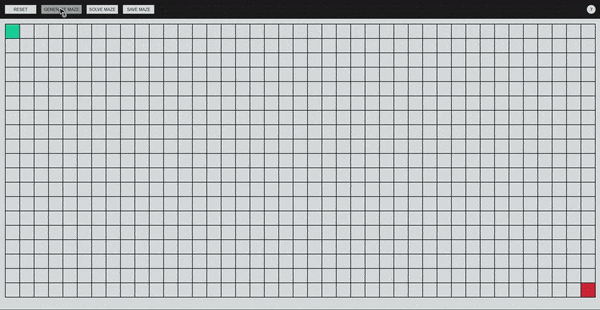
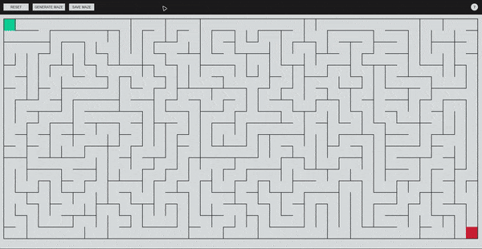

This is a maze generator that can be used to generate grid mazes.<br>
Demo at : [https://projects-rye-mazegenerator.vercel.app/](https://projects-rye-mazegenerator.vercel.app/)

## Features

- ### Drag the grid cells using left/right click to add/remove paths
  
- ### Set custom start and end points
  
- ### Generate a random maze
  
- ### Save the maze as an image
  
- Auto generate a maze (to be developed)
- Solve the maze (to be developed)

Note: This is a [Next.js](https://nextjs.org/) project bootstrapped with [`create-next-app`](https://github.com/vercel/next.js/tree/canary/packages/create-next-app).

## How to run

First, run the development server:

```bash
npm run dev
# or
yarn dev
# or
pnpm dev
# or
bun dev
```

Open [http://localhost:3000](http://localhost:3000) with your browser to see the result.

You can start editing the page by modifying `app/page.tsx`. The page auto-updates as you edit the file.
